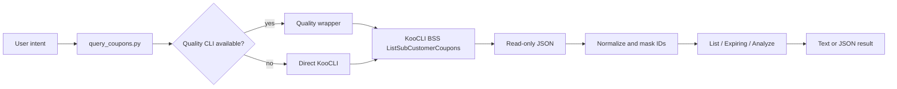

# Data Flow

```mermaid
flowchart LR
    A[User intent] --> B[query_coupons.py]
    B --> C{Quality CLI available?}
    C -->|yes| D[Quality wrapper]
    C -->|no| E[Direct KooCLI]
    D --> F[KooCLI BSS ListSubCustomerCoupons]
    E --> F
    F --> G[Read-only JSON]
    G --> H[Normalize and mask IDs]
    H --> I[List / Expiring / Analyze]
    I --> J[Text or JSON result]
```

The flow never invokes claim, transfer, deduction, or delete operations.
